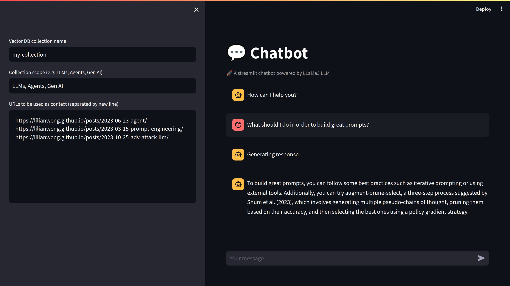

<h1 align="center">RAG Agent with LangChain and LLaMA3</h1>

<p align="center">
  
  
  
  
  
</p>

<p align="center">Fully local RAG agent powered by LLaMA3 and LangChain</p>



## Installation

### Python

Create a virtual environment and install the requirements:

```bash
python -m venv .venv
pip install -r requirements.txt
```

### LLM

If you don't have ollama installed, follow this [doc](https://ollama.com/download).

And then run:

```bash
ollama pull llama3
```

## Running the project

Go to `Run and Debug` in VSCode and select `Debug App`.

## References

- [YouTube](https://www.youtube.com/watch?v=-ROS6gfYIts)
- [Jupyter Notebook](https://github.com/langchain-ai/langgraph/blob/main/examples/rag/langgraph_rag_agent_llama3_local.ipynb)
- [LLaMA3](https://llama.meta.com/llama3)
- [Ollama](https://ollama.com)

## Troubleshooting

### Ollama

If you have any issues with ollama running infinetely, try to run the following command:

```bash
sudo systemctl restart ollama
```

Or:

```bash
pgrep ollama # returns the pid
kill -9 <pid>
sudo systemctl start ollama
```
